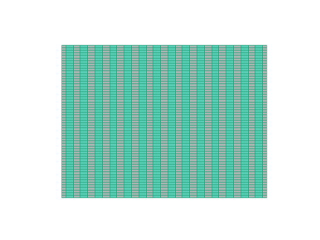
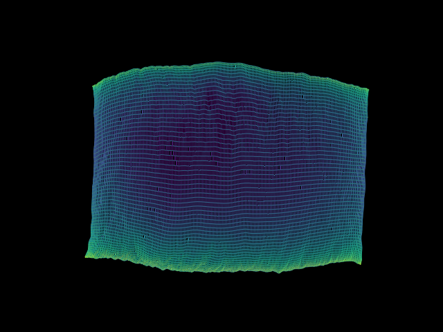
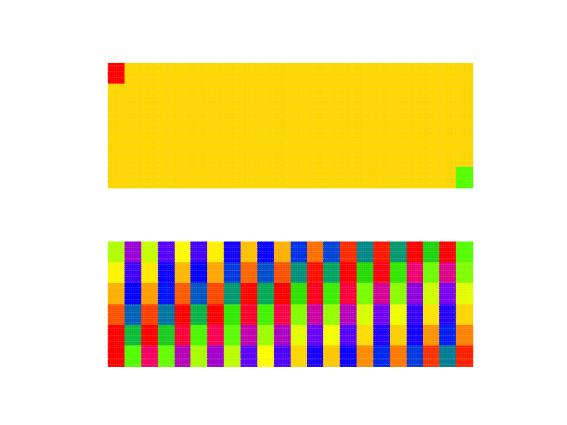
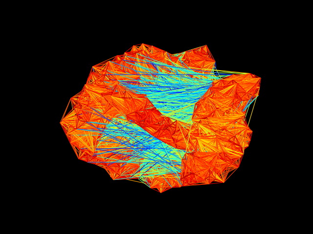
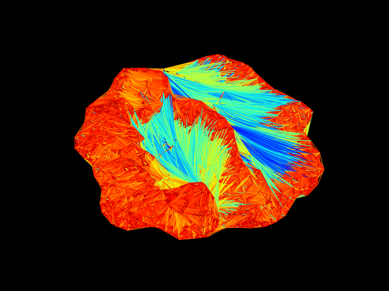
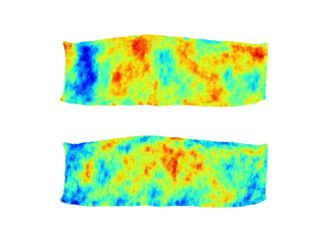
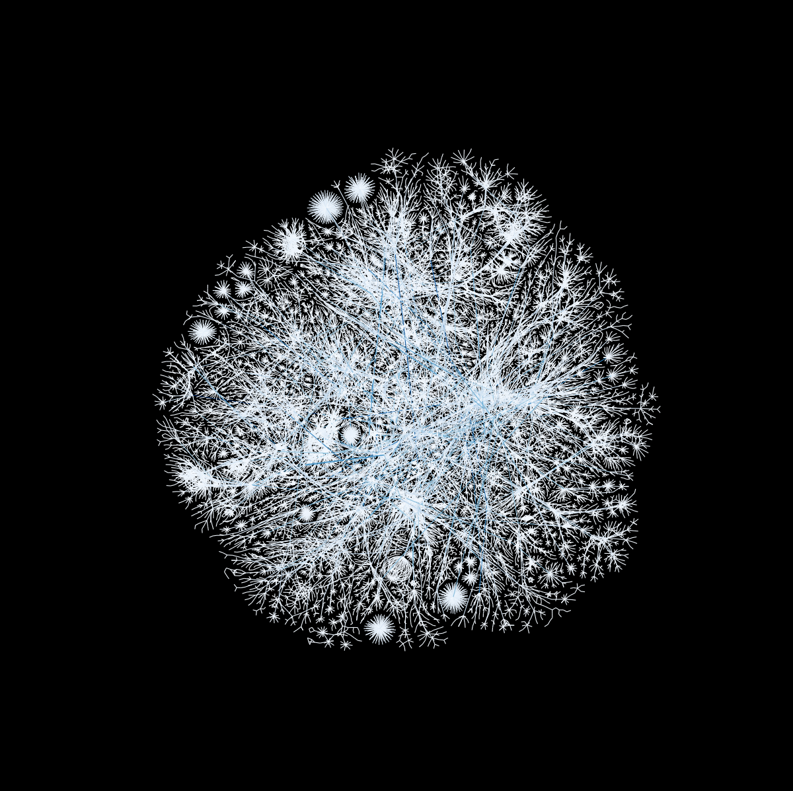
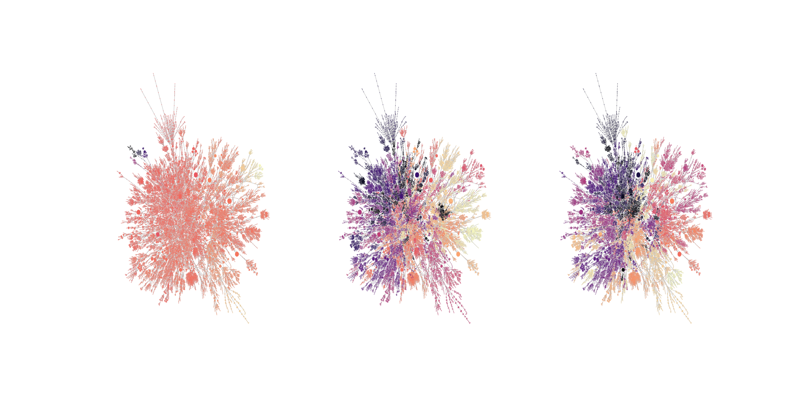

# Graph Visualization Tool
Visualize graphs using [networkX](https://networkx.github.io/), [matplotlib](https://matplotlib.org/), and [graphviz](https://www.graphviz.org/).

# Source Files:
---
## `generate_pos.py`
Generates a position file using graphvis' sfdp.

### Usage: 
`python3 generate_pos.py matrix_filename.txt [-o output_filename] [-d]`

### Arguments:
  * `matrix_filename` Graph file location
  * `-o` Where to save position file
  * `-d` If the input matrix `A` is not square, consider the graph `A^T A` instead of the default `AA^T`
---
## `graph_vis.py`
Visualize a graph and optional node data.  
If node data is not provided, edge colors will be based on the Euclidian length.

### Usage: 
`python3 graph_vis.py matrix_filename.txt position_filename.pos [node_data] [-ns 40.0] [-cols 2] [-d] [-l] [-log][-cm jet]`

### Arguments:
  * `matrix_filename` Graph file location
  * `pos_filename` Position file location
  * `node_data` Node data file locations
  * `-ns` Node size
  * `-cols` Number of columns in output
  * `-d` If the input matrix `A` is not square, consider the graph `A^T A` instead of the default `AA^T`
  * `-l` Use light background
  * `-log` Use log of node data
  * `-cm` Set matplotlib colormap
  
  
# Examples:
## Geometric Positions
If node positions are known beforehand, such as from a mesh, they can be used to get a more accurate graph image.

`python3 graph_vis.py graphdata/fe_vertex_edge.txt geometric.pos`

## Generated Positions
If node positions are not known beforehand, they can be generated with `sfdp`:

`python3 generate_pos.py graphdata/fe_vertex_edge.txt -o generated.pos`

`python3 graph_vis.py graphdata/fe_vertex_edge.txt generated.pos`

  
## Node Data
Multiple node data can be sepecified at the command line

`python3 graph_vis.py graphdata/fe_vertex_edge.txt geometric.pos graphdata/fe_rhs.txt graphdata/fe_part.txt`

If node data is not provided, the node connections will be colored based on Euclidian distance.

`python3 graph_vis.py graphdata/vertex_edge_sample.txt sample.pos`

`python3 graph_vis.py graphdata/vertex_edge_sample.txt sample.edge.pos -d`

## Dual Graph
If the input graph `A` is not square, the default action is to visualize `AA^T`.
The dual graph `A^T A` can be visualized using the `-d` flag.  Where the position file corresponds to the dual graph as well.

Log permeability of several slices of SPE10 dataset.  Using the `-d` flag to visualize `edge_vertex * vertex_edge` relationship:
`python3 graph_vis.py graphdata/fe_vertex_edge.txt generated.edge.pos graphdata/fe_weight_0.txt graphdata/fe_weight_19.txt -d -log -l`

## Color and size
Colormaps from matplotlib can be set from the command line

`python3 graph_vis.py graphdata/internet.txt internet.pos -l -cm Blues_r`

Node size can also be set from the command line

`python3 graph_vis.py graphdata/internet.txt internet.pos fiedler.txt part100.txt part300.txt -l -cm magma -ns 0.1`

